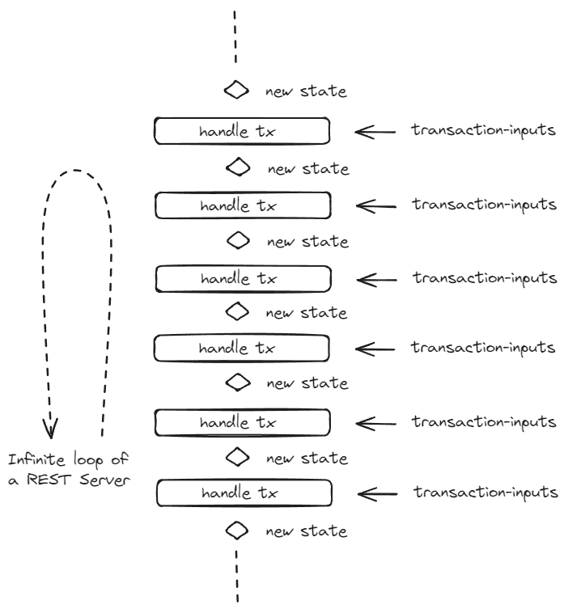
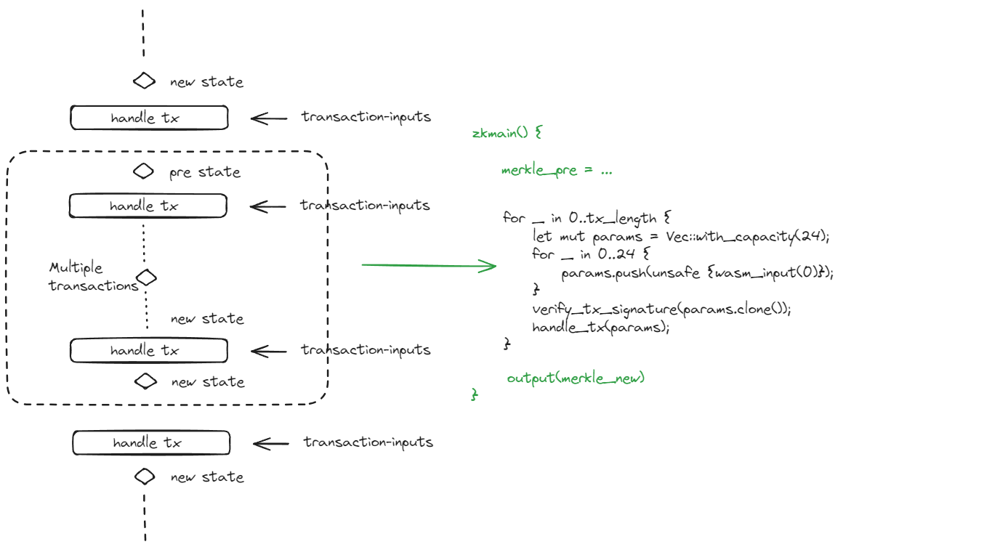

# Rollup Application Sketch
We treat the server code of an application as a constant runing service, which has the following code sketh:
```
pub server() {
    while(true) {
        let mut params = Vec::with_capacity(20 + 16);
        for _ in 0..20 {
            params.push(unsafe {wasm_input(0)});
        }
        let command = unsafe {wasm_input(0)};
        let command_length = ((command & 0xff00) >> 8)  as usize;
        unsafe { zkwasm_rust_sdk::require(command_length < 16) };
        params.push(command);
        for _  in 0..command_length - 1 {
            params.push(unsafe {wasm_input(0)});
        }
        verify_tx_signature(params.clone());
        handle_tx(params);
    }
}
```

The following graph represents the infinite loop structure with a breakdown of its components and their interactions:

<p align="center">
<picture>
  <source media="(prefers-color-scheme: dark)" srcset="../assets/images/minirollup-nature.png">
  
</picture>
</p>


However, since the above infinite loop of ``while(true)`` will produce a infinite execution trace of a WASM image, the server execution can not been proved in one single proof. To resolve this, we need to add a preemption point in the while loop so that after a few transactions have been handled, we can produce a proof only for an finite amount of transactions.

<p align="center">
<picture>
  <source media="(prefers-color-scheme: dark)" srcset="../assets/images/minirollup-bundled.png">
  
</picture>
</p>

Once the execution is splitted into bundled transactions groups, we need to store the merkle state at the end of the premption point and then resture the state at the begining of each bundle. Put it all together, we have the following code.

```
#[wasm_bindgen]
pub fn zkmain() {
    use zkwasm_rust_sdk::wasm_input;
    use zkwasm_rust_sdk::wasm_output;
    use zkwasm_rust_sdk::wasm_trace_size;
    let merkle_ref = unsafe {&mut MERKLE_MAP};
    let tx_length = unsafe {wasm_input(0)};

    unsafe {
        initialize([wasm_input(1), wasm_input(1), wasm_input(1), wasm_input(1)].to_vec())
    }

    for _ in 0..tx_length {
        let mut params = Vec::with_capacity(20 + 16);
        for _ in 0..20 {
            params.push(unsafe {wasm_input(0)});
        }
        let command = unsafe {wasm_input(0)};
        let command_length = ((command & 0xff00) >> 8)  as usize;
        unsafe { zkwasm_rust_sdk::require(command_length < 16) };
        params.push(command);
        for _  in 0..command_length - 1 {
            params.push(unsafe {wasm_input(0)});
        }
        verify_tx_signature(params.clone());
        handle_tx(params);
        let trace = unsafe {wasm_trace_size()};
        zkwasm_rust_sdk::dbg!("trace track: {}\n", trace);
    }

    unsafe { zkwasm_rust_sdk::require(preempt()) };

    let root = merkle_ref.merkle.root;
    unsafe {
        wasm_output(root[0]);
        wasm_output(root[1]);
        wasm_output(root[2]);
        wasm_output(root[3]);
    }

    unsafe {
        wasm_output(txdata[0]);
        wasm_output(txdata[1]);
        wasm_output(txdata[2]);
        wasm_output(txdata[3]);
    }
}
```

Once the above execution proof has be generated, we can submit the proof to a settlement contract which will verify the proof then perform settlement activities and update the merkle state.
