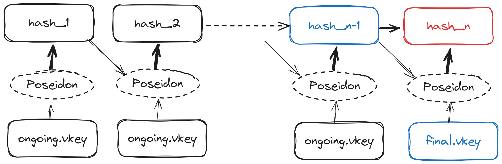

# Continuation Proof of Segments
In zkWasm, when the traces of a program are very long (>1M wasm instructions), it is not practical to directly generate a single proof for the entire program. Therefore, it is necessary to divide the traces of the program into multiple segments and generate proofs for each segment. zkWasm automatically divides the program into segments and ensures the correctness of context continuity between adjacent segments (such as memory read/write, instruction jumps, etc.) by aggregating these proofs to one single proof. This method of generating proofs is called "Continuation proof". When using zkWasm to generate a continuation proof, it mainly involves two steps:

1. Generate zkWasm proofs for each segment.
2. Aggregate the proofs generated above using [continuation-batcher](https://github.com/DelphinusLab/continuation-batcher) to generate the final batch proof, which is the proof that needs to be verified on the chain.

> Note: In the following tutorials, the characters starting with `$` need to be replaced with the actual configuration used.

## 1.1 Generating proofs for segments
Firstly, use [zkWasm](https://github.com/DelphinusLab/zkWasm) to set up the proof generation and generate vkeys for segments. Here, the continuation features need to be enabled.
```
cd zkWasm
cargo run --release --features continuation,cuda $NAME setup
```

Where `$NAME` is the configuration prefix for generating continuation proofs. Both the generated vkey and proof files will have this prefix. Unlike non-continuation proofs, two types of vkeys will be generated: `$NAME.circuit.finalized.data` (corresponding to the last segment) and `$NAME.circuit.ongoing.data` (corresponding to non-last segments), which are independent of the specific wasm program.

## 1.2 generate proofs:

```
cargo run --release --features continuation,cuda -- --params ./params $NAME prove --wasm $pwd/params/$WASM_IAMGE --output $pwd/output 
```

During this process, zkWasm will first run the specified `$WASM_IAMGE` and generate traces files for the program in the `output` directory. It will then divide the traces into N segments, generating instances (`$NAME.$.instance.json`) and proofs (`$NAME.$.transcript.json`) for each segment. Information about N segment instances and proofs are written into the `$NAME.loadinfo.json` file for subsequent proof aggregation.

## 2. Aggregating proofs of segments
Aggregate the proofs generated above using [continuation-batcher](https://github.com/DelphinusLab/continuation-batcher):

```
cd continuation-batcher
cargo run --release --features cuda -- --params $pwd/params --output $pwd/output batch -k 22 --challenge sha --info  $pwd/output/$NAME.loadinfo.json --name ${NAME}_agg --commits $CONT_BATCH_INFO --cont
```
> It is important to note that the params and output directories should be consistent with those in Section 1 to correctly read the structured reference string (SRS) and the file information described in `$NAME.loadinfo.json`. Better to specifies a different name from Section 1 for the `--name` parameter, such as adding the suffix `_agg` to avoid naming conflicts. `$CONT_BATCH_INFO` is a JSON configuration file for the batcher, specifying the constraints on `img_col` and `post_img_col` between adjacent segments (**to be modified**).

This command first generates the verifier circuit's vkey (`params/${NAME}_agg.0.agg.vkey.data`) and proof (`output/${NAME}_agg.0.agg.transcript.data`) for the first segment, and constructs an aggregate circuit that takes this proof, instance, and vkey as well as the proof, instance, and vkey of the next segment as witness inputs. It then aggregates them to generate a new aggregate vkey (`params/${NAME}_agg.agg.vkey.data`), aggregate instance, and aggregate proof (`output/${NAME}_agg.1.agg.transcript.data`). This aggregate vkey remains unchanged in subsequent proof aggregation, and it is referred to as "flat vkey". This process repeats until the final aggregate proof, vkey, and instance are generated.

## Verification of Continuation Proof of Segments
On-chain verification only requires verifying the final proof aggregated in Section 2, which proves the correctness of all segments' execution. However, we need to ensure that the rounds aggregated by the circuit for non-final segments and including the last segment, are included in the batcher. This is done by hashing these vkeys and placing them into the instance. Therefore, on-chain verification also needs to verify the correctness of the hash contained in the instance. The verification will involve two checks:

1. Correctness of the vkey hash (input hash_n-1 and final.vkey into the hash function to obtain hash_n, then verify its correctness against the hash in the instances submitted in the proof, instances[0]).

2. Proof verification.
