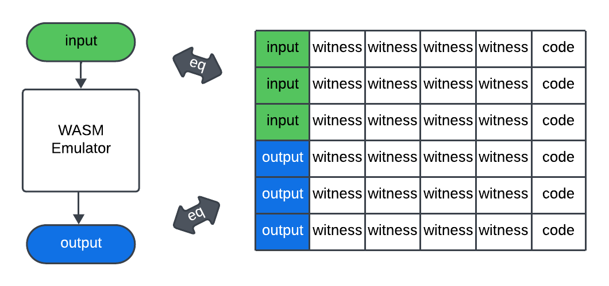

# Circuit Design

## 1 INTRODUCTION
WASM (or WebAssembly) is an open standard binary code format close to assembly. Its initialobjective is to provide an alternative to java-script with better performance in the current webecosystems. Benefiting from its platform independence, front-end flexibility (can be compiled fromthe majority of languages including C, C++, assembly script, rust, etc.), good isolated runtimeand speed that is close to native binary, its usage starts to arise in the distributed cloud and edgecomputing. Recently it has become a popular binary format for users to run customized functionson AWS Lambda, Open Yurt, AZURE, etc.

**The Problem.** To implement a ZKSNARK-backed WASM virtual machine, we need to connect the implementation of WASM runtime with the proof system of ZKSNARK. In general, a ZKSNARK system is represented in arithmetic circuits with polynomial constraints. Therefore we need to abstract the full imperative logic of a WASM virtual machine systematically and rewrite it into arithmetic circuits with constraints. Given two outputs, one is generated by emulating the WASM bytecode in WASM runtime that enforces the semantics of WASM specification, and the other satisfies the constraints imposed on the arithmetic circuits. If the circuits we write preserve the semantics, these two outputs must be the same. Hence the proof of the ZKSNARK derived from the circuits also shows that the output is valid as a result of emulating the bytecode in WASM runtime.

<picture>
  <source media="(prefers-color-scheme: dark)" srcset="./assets/images/1_taskbar.png">
  
</picture>

**Organization of the document.** After a brief introduction to the basic ideas about how to connect a stateful virtual machine with ZKSNARK in Section 2, we describe the basic building block and ingredients used to construct ZKWASM circuits in Section 3 and then present the circuits architecture in Section 4. After the architecture is settled, we discuss the circuits of every category of WASM instructions in Section 5. In addition, in Section 5.4 we discuss foreign instruction expansion which provides a way to extend the virtual machine for better performance and integration. In Section 6, we present the partition and proof batching technique to solve the long execution trace problem.

Throughout the document, we use the notation $$a:A$$ to specify a variable of type $$A$$, $$F$$ to specify the number field, and $$F_n$$ to specify a multi-dimensional vector with dimension $$n$$. We denote by $$A \rightarrow B$$ the function type from $$A$$ to $$B$$ and use $$\circ$$ for function composition. Moreover, we use $$G[i][j]$$ to specify the value of the cell of matrix $$G$$ at the $$i$$ th row and $$j$$ th column.

## 2 WASM Run-Time as a State Machine
We consider the WASM virtual machine as a gigantic program, with the input as a tuple $$(I(C, H), E, IO)$$ ,where $$I$$ is a WASM executable image that contains a code image $$C$$ and an initial memory $$H$$, $$E$$ is its entry point, and $$IO$$ represents the **(stdin, stdout)** firmware. In the serverless setup, the WASM run-time starts with an initial state based on the loaded image $$I$$, then jumps to the entry point $$E$$ and starts executing the bytecode based on the WASM specification.

Internally the WASM run-time maintains a state $$S$$ denoted by a tuple ($$iaddr$$, $$F$$, $$M$$, $$G$$, $$Sp$$, $$I$$, $$IO$$) where $$iaddr$$ is the current instruction address, $$F$$ is the calling frame with a `depth` field, $$M$$ is the memory state, $$Sp$$ is the stack and $$G$$ is the set of global variables. The run-time simulates the semantic of each instruction start at $$E$$ until it reaches the exit. The instructions it simulates form an execution trace $$[t_0, t_1, t_2, t_3, \cdots]$$ and each transition $$t_i$$ is a function between states that takes an input $$s: S$$ and outputs a new state $$s': S$$.

For simplicity, we will use the notation of record field to specify a field in state $$s:S$$. For example, $$s.iaddr$$ denotes the current instruction address of state $$s$$, $$s.IO.stdin$$ denotes the input of state $$s$$, etc. We also use $$s.iaddr.op$$ to denote the opcode (operation code that specifies the operation to be performed) at address $$s.iaddr$$ in the code section $$C$$ of image $$I$$.

Based on the above definition, we define the criteria for a list of state transitions to be validunder $$(I(C, H), E, IO)$$, as follows.

-- **Definition 2.1** (Valid Execution Trace). Given a WASM machine with input $$(I(C, H), E, IO)$$, and $$s_0$$ is the initial state with $$s_0.iaddr = E$$. A valid execution trace is a list of transition functions $$t_i$$ suchthat the following holds:
(1) For all $$k$$, $$s_k = t_{k-1} \circ \cdots \circ t_1 \circ t_0 (s_0)$$, $$t_k$$ enforces the semantics of $$s_k.iaddr.op$$.
(2) If $s_e$ is the last state, then the depth of the calling frame is zero: $se.F.depth = 0$.

## 3 IO of ZKWASM
The outermost function of ZKWASM is of type `zkmain(void): (void)`. To access the external IO, we use two builtin host functions: *zkwasm_input* and *zkwasm_output*. Suppose that we have an array of instances [$$I_i$$] and a internal cursor $$k$$,  *zkwasm_input(1)* binds the $$k$$th instance to the top of the stack and similarly *zkwasm_output()* binds the current top of the stack with $$I_k$$. Both *zkwasm_input* and *zkwasm_output* increase the cursor $$k$$. We can also access external witness by *zkwasm_input(0)*, when doing so we just fill the top of the stack with a witness which does not bind with any public instances.

## 4 Succinct Proof of the circuits
Compared with a standard WASM run-time, ZKWASM aims to provide a proof to prove that the output is valid so that it can be used in scenarios which require trustless and privacy computation. Moreover, the verifying algorithm needs to be simple in the sense of complexity to be useful inpractical. In zkWasm we have three different categories of circuits.

1. Guest circuits: enforces the semantics of slices of execution traces.
2. Host circuits: enforces the semantics of host API calls
3. Aggregation circuits: batch the guest circuits and host circuits and connect proofs of slices of execution.

## 5 Overall layout of circuits
The circuits of ZKWASM contains four global tables: execution table, image table, frame table and memory table, two assist tables: bit operation table and range table; and one host table which is used to connect host circuits that are implemented in separated external circuits.

### Global tables
* 1. The execution table represents the execution trace of the WASM bytecode. Thus the table is splited into sections and each section represents a transition function $$t_i$$. The semantics of each $$t_i$$ is decided by the opcode of the wasm byte code. Since there are more than 100 different opcodes in WASM specification, the opcode will be the indicator (switch) of which constraint group should be enabled for $$t_i$$.

* 2. The image table (pre & post) contains the snap shot of the memory when the execution trace start (the preimage) and finish (the postimage) executing.

* 3. The memory table contains the memory accessing record for each read and write of a memory or stack or image address. In WASM specification, memory, stack, image are in separated address spaces.

* 4. The frame table contains the record of function calling frames. In wasm specification, callers' instruction pointer is not recorded in the stack thus the semantics is enforced by the wasm runtime.

### Assist tables
* 1. Bitwise operation table: lookup table for bitwise opcodes operands and results.
* 2. Range table: enforces range check for u8, u16, etc ...

### Host tables

