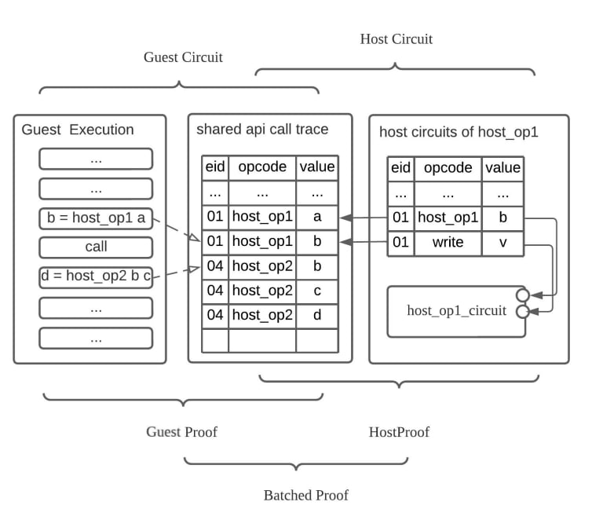

# zkWASM Host Circuits


## 1. Motivation
Customizable host circuits and host API is a key feature of DelphinusLab zkWASM which provides a way to support the WASM host API specification.

In WASM, the user can provide runtime host functions and call those functions in WASM bytecode through function calls (see the following example).

### Example of code calls host API:

```
extern void host_api_1(int x, int y, int z);
extern int host_api_2(int b);
int main(int a) {
  if (a > 1) {
    host_api_1(a,1,2);
  } else {
    int b = host_api_2(a);
    host_api_1(b,2,1);
  }
  return;
}
```
After compilation of the above code written in $C$ to WASM (or WAT) as follows.
```
 (import "env" "host_api_1" (func $host_api_1 (param i32 i32 i32)))
 (import "env" "host_api_2" (func $host_api_2 (param i32) (result i32)))
 (func $zkmain (; 2 ;) (param $0 i32) (result i32)
  (block label
   (br_if label (i32.lt_s (get_local $0) (i32.const 2)))
   (call $host_api_1 (get_local $0) (i32.const 1) (i32.const 2))
   (return)
  )
  (call $host_api_1
   (call $host_api_2
    (get_local $0)
   )
   (i32.const 2)
   (i32.const 1)
  )
  return
 )
)
```

We notice that the host APIs (host_api_1 & host_api_2) are not implemented by wasm but provided by the host env. Delphinus ZKWasm supports the host environment by providing host functions to the WASM Emulator if the host environment can provide two things:
1. The witness of host API outputs.
2. The circuit that can prove the host API outputs and inputs enforces the semantics.

The witness generated for host API outputs is used for the WASM Emulator so that the WASM Emulator can continue to generate execution traces for the ZKWasm guest prover. However since the ZKWasm guest prover can only prove the bytecode of WASM, it can not prove that the witness (outputs and inputs of host API calls) are valid. To solve this problem, We introduce a host VM that can leverage the host API circuit to prove that the witness of host API calls are valid. In the end, the Delphinus ZKWasm proof batcher combines the proof of both the guest and host to generate a final proof (see the proof generation architecture below).<br>

<p align="center">
<picture>
  <source media="(prefers-color-scheme: dark)" srcset="./assets/images/Guest_Host_Batched_Proof.png">
  
</picture>
</p>

When the proof batching circuit combines the proofs from the guest circuit and host circuit, it checks two things:
1. Each proof checks.
2. The host API call traces are the same both in the guest circuit and in the host circuit.


## 2. Restriction of customizable circuits for host API.
Some customizable circuits might have dynamic input sizes. For example, one might want to provide a host circuit of multi-scalar multiplication (MSM) that can process arbitrary numbers of elliptic curve cryptography (ECC) point addition.

```
ecc_add(ECCPoint *points, ECCPoint *)
```

However, WASM doesn't provide specifications for the host to access guest memory. Therefore we require the host env to track the mutable context of the host API itself. i.e., the host env should not change the memory or the stack. In addition, during the execution of a WASM image, multiple host APIs might be called in an undecided order. Because one specific host circuit might only have the ability to prove one specific host API, we provide the following architecture to utilize all the host circuits to work together to prove the correctness of a host API calling trace.


## 3. The architecture of Host VM.
The host VM usually contains three gates the selecting gate, the processing gate, and the operation gate.

### Selecting Gate:
The selecting gate contains two tables. The shared operands table contains all the host operations called during the guest zkWASM VM trace and the selected operands table contains the operation that can be processed in the current host circuit.

#### Example: Shared operand table

| op_code | arg | idx |
| --------|-----| ----|
| 0       |   0 | 0   |
| op_a    | a_0 | 1   |
| op_a    | a_1 | 2   |
| op_a    | a_r | 3   |
| sum_in  | b_0 | 4   |
| sum_in  | b_1 | 5   |
| sum_in  | b_2 | 6   |
| sum_ret | b_3 | 7   |
| sum_in  | b_4 | 8   |
| sum_in  | b_5 | 9   |
| sum_ret | b_6 | 10  |

#### Example: Selected operand table
| op_code | arg     | idx_sel |
| --------|-------- | --------|
| sum_in  | $b_0$   |  4      |
| sum_in  | $b_1$   |  5      |
| sum_in  | $b_2$   |  6      |
| sum_ret | $b_3$   |  7      |
| sum_in  | $b_5$   |  8      |
| sum_in  | $b_6$   |  9      |
| sum_ret | $b_7$   |  10     |

### Processing Gate:
The processing gate needs to be a uniform gate that has uniform constraints for all opcodes that are handled in the current circuits.

For example, in the hash circuit, there are three opcodes: **hash_cont**, **hash_push** and **hash_finalize**. The construction of the processing gate is as following:

| advice | advice | advice | advice | advice | advice | fix |
|--------|--------|--------|--------|--------|--------|-----|
| operand| opcode | idx    | m_operand | merge_ind | trans_ind | start |
| nil    | opcode_n | idx_n | nil      | nil       | trans_ind_n | nil |


Suppose that in the zkWASM guest execution trace, there is the following shared host api calling trace:

| op_code | arg | idx |
| --------|-----| ----|
| 0       |   0 | 0   |
| op_a    | a_0 | 1   |
| op_a    | a_1 | 2   |
| op_a    | a_r | 3   |
| hash_reset | true | 4   |
| hash_push  | b_1  | 5   |
| hash_reset | false | 6   |
| hash_push  | b_2 | 7   |
| hash_finalize | b_3 | 8   |
| op_b    | b_0 | 9   |
| op_b    | b_1 | 10   |
| op_b    | b_r | 11   |
| hash_reset | true | 12   |
| hash_push  | h_4  | 13  |
| hash_reset | false | 14   |
| hash_push  | h_5 | 15   |
| hash_reset | false | 16   |
| hash_push  | h_6  | 17  |
| hash_reset | false | 18   |
| hash_push  | h_7 | 19   |
| hash_finalize | h_8 | 20   |

The processing gate picks all the hash-related ops into itself through lookup constraints and calculates the selected operand, opcode, idx and the derived trans_ind.

| operand| opcode    | idx    | m_operand | merge_ind | trans_ind |
|--------|-----------|--------|-----------|-----------|-----------|
| true   | hash_reset| 4      | true      | 0         | 0         |
| b_1    | hash_push | 5      | b1        | 0         | 0         |
| false  | hash_reset| 6      | false     | 0         | 1         |
| b_2    | hash_push | 7      | b2        | 0         | 1         |
| b_3    | hash_final| 8      | b3        | 0         | 1         |
| true   | hash_reset| 12     | true      | 0         | 2         |
| h_4    | hash_push | 13     | h_4       | 0         | 2         |
| false  | hash_reset| 14     | false     | 0         | 3         |
| h_5    | hash_push | 15     | h_5       | 0         | 3         |
| flase  | hash_reset| 16     | false     | 0         | 4         |
| h_6    | hash_push | 17     | h_6       | 0         | 4         |
| flase  | hash_reset| 16     | false     | 0         | 5         |
| h_7    | hash_push | 17     | h_7       | 0         | 5         |
| h_8    | hash_final| 18     | h_8       | 0         | 5         |

## Operation Gate:
The operation gate is the universal state transformation circuit that encodes the host function as a state transformation.

<p align="center">
<picture>
  <source media="(prefers-color-scheme: dark)" srcset="./assets/images/universal_operation_gate.png">
  
</picture>
</p>

Each state transformation can contain multiple configuration and observation points which form a one-one relation between the operation gate and the processing gate. E.g., if we take the hash host circuit to be a state tranformation that has one configuration point; **hash_reset**, which indicates whether the start transform needs to be reset, and one observation point; **hash_final** which ensures the result of the hash is equal to the operand of **hash_final**.

[back](./)