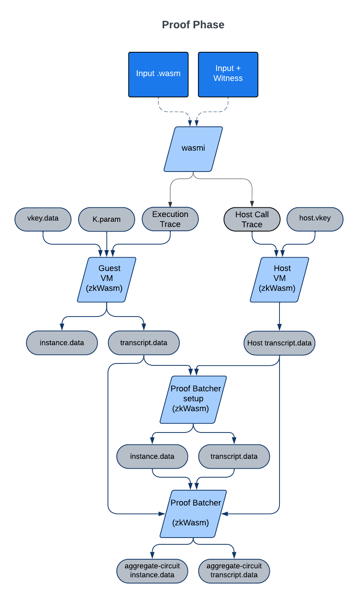

# Generating a Proof

Generating a ZK-proven application whose proof is deployment ready is broken down into three stages.

1. Setup Phase.
2. Proof Phase.
3. Deploy Phase.

In the Proof Phase a web assembly image is processed by zkWasm to generate a zkSNARK circuit for the application itself. The Proof Phase generates a zero knowledge proof corresponding to the applications execution against a guest and host virtual machine. Finally in the Deployment Phase a verification contract for the application is deployed on an EVM compatible network.<br>

## Prepare WASM Image:
Since ZKWASM runs Web Assembly, applications that are suppose to run in ZKWASM have to be compiled into WASM. WebAssembly (WASM) is designed to be a portable compilation target for programming languages, enabling deployment on the web for client and server applications. A wide range of languages can be compiled into Wasm, with varying degrees of support. Some of the most notable languages include:

C/C++: These are the most well-supported languages for compiling to WebAssembly. Tools like Emscripten are used to compile C and C++ code to Wasm.

Rust: Rust has robust support for WebAssembly. It’s often chosen for Wasm projects due to its performance characteristics and safety guarantees.

AssemblyScript: A variant of TypeScript, AssemblyScript is designed to compile to WebAssembly. It’s a good choice for developers familiar with TypeScript or JavaScript.

Go: Go has experimental support for WebAssembly. While not as mature as C/C++ or Rust, it is still a viable option.

Python, Ruby, and PHP: These languages have experimental or early-stage support for WebAssembly. Tools and runtimes are being developed to compile these languages to Wasm, but they may not yet be suitable for production use.

Kotlin/Native: Kotlin can target WebAssembly, allowing Kotlin code to run in the browser.

The ability to compile a language to WebAssembly largely depends on the availability of a suitable compiler or toolchain. The WebAssembly ecosystem is rapidly evolving, and new tools and languages are constantly being added to the list.


### Generate WASM from C (or C++) code

Following is a trivial piece of C code "zkmain.c" that compares two inputs (one from the public input and the other from the private input) and requires that these two inputs are equal.

```C
#include <stdint.h>
uint64_t wasm_input(uint32_t);
extern void require(int cond);

static inline uint64_t wasm_public_input()
{
  return wasm_input(1);
}

static inline uint64_t wasm_private_input()
{
  return wasm_input(0);
}

__attribute__((visibility("default")))
int zkmain() {
    uint64_t public = wasm_public_input();
    uint64_t private = wasm_private_input();
    require(public == private);
    return 0;
}
```

To compile the above piece of C code into WASM, we use the clang-15 as our C compiler and set the target binary to be wasm32
```
LIBS  = -lkernel32 -luser32 -lgdi32 -lopengl32
CFILES = $(wildcard *.c)

ifeq ($(CLANG),)
CLANG=clang-15
endif

FLAGS = -flto -O3 -nostdlib -fno-builtin -ffreestanding -mexec-model=reactor --target=wasm32 -Wl,--strip-all -Wl,--initial-memory=131072 -Wl,--max-memory=131072 -Wl,--no-entry -Wl,--allow-undefined -Wl,--export-dynamic

all: output.wasm

output.wasm: $(CFILES)
	$(CLANG) -o $@ $(CFILES) $(FLAGS) $(CFLAGS)


clean:
	rm -f *.wasm *.wat
```

Put the above Makefile in the same folder as zkmain.c and type
```
make
```
will give the desired wasm file output.wasm. This file can be then used to run in the ZKWASM VM to generate proofs once inputs are provided. Also, more C to zkWASM program sdk can be find in Delphinus Lab's [zkWasm-C](https://github.com/DelphinusLab/zkWasm-C) repo.


### Generate WASM from Rust code

Here we use rust as a reference language, thus all examples are coded and compiled using wasm-bindgen. wasm-bindgen is a tool and library for facilitating high-level interactions between WebAssembly (Wasm) modules and JavaScript. It’s particularly prominent in the Rust ecosystem, but its principles can be applied to other languages that compile to WebAssembly.

To use wasm-bindgen in your rust project, you can simply put it in your Cargo.tom as follows:

```
[dependencies]
zkwasm-rust-sdk = { git = "https://github.com/DelphinusLab/zkWasm-rust.git" }
wasm-bindgen = "0.2.83"
```

Suppose that we use zkmain.rs as the main entry point of your application. We can start our application as follows:

```
use zkwasm_rust_sdk::wasm_output;
  use zkwasm_rust_sdk::wasm_input;
  use zkwasm_rust_sdk::wasm_dbg;
  use zkwasm_rust_sdk::require;

#[wasm_bindgen]
pub fn zkmain() -> {
    let mut hasher = Sha256::new();
    let commands_len = unsafe {wasm_input(0)};
    for _ in 0..commands_len {
        let command = unsafe {wasm_input(0)};
        hasher.update(command.to_le_bytes());
        step(command);
    }
    let msghash = hasher.finalize();
    zkwasm_rust_sdk::dbg!("Hello world application with command hash {:?}\n", msghash);
}
```

Simlarly the Makefile used to generate WASM from RUST is the following:
```
build:
	wasm-pack build --release --out-name rust-sdk-test.wasm --out-dir pkg --features wasmbind
	wasm-opt -Oz -o output.wasm pkg/rust-sdk-test.wasm

clean:
	rm -rf pkg output params
```

### File output after WASM code generation.
Once you have compiled your C (C++) and RUST code, the directory should look like the below:

```
.
├── Makefile
├── output.wasm
└── zkmain.c/zkmain.rs
```

The file `ouput.wasm` will be the input image for zkWasm's Setup Phase below.


## Setup Phase:

With the wasm bytecode beinging generated, we can start setup the circuit of the VM. In the Setup Phase an application as a wasm image is used as input to zkWasm to generate a zkSNARK circuit for the application. The setup phase generates the output vkey.data for the image which is a circuit that commits its constant column.

There are two modes to setup ZKWASM, the uniform-circuit mode and the image specific mode.

### the unifirom-circuit mode
In other words it is a program that has been fixed. In following proof is submissions, zkWasm will open and check the commitment of this vkey to make sure the same program is being executed. This is the combination of the .param and vkey.data files.<br>

<p align="center">
<picture>
  <source media="(prefers-color-scheme: dark)" srcset="./assets/images/Setup_Phase_wbg.png">
  
</picture>
</p>

Within the directory `./zkWasm/` with the program build using [environment setup](./Environment.md), run the setup stage of zkWasm with the input .wasm image (`ouput.wasm`) from above.

```
cargo run --release --features uniform-circuit -- --host standard -k 18 --function zkmain --output $PROJECT/output --wasm $PROJECT/output.wasm setup
```

This produces the output files in `./params/`
```
.
├── Makefile
├── output.wasm
├── params
  ├── K18.params
  ├── K21.params
  ├── zkwasm.vkey.data
  └── zkwasm.circuit.data
└── zkmain.c/zkmain.rs
```

## Proof Phase:

In the Proof Phase the web assembly interpreter (wasmi) outputs two traces; the web assembly bytecode as the execution trace & the host API call trace. These record
the order of the host API calls and their output. The combination of the two traces ensures the host call trace is in the same order as the execution trace (including the same input arguments).<br>

<p align="center">
<picture>
  <source media="(prefers-color-scheme: dark)" srcset="./assets/images/Proof_Phase_wbg.png">
  
</picture>
</p>


To generate a single proof using zkWasm using the wasm image generated from the C code above `output.wasm`, we simply run the ZKWASM VM with that image and  provide a public input `--public 2:i64` and a private input `--private 2:i64` to it.

```console
$ZKWASMBIN/delphinus-cli --host standard -k 18 --function $FUNC --output ./output --param ./output --wasm ./pkg/output.wasm single-prove --public 1:i64 --private 1:i64
```

This produces the following files in the output directory `--output ./output`:

```
.
├── Makefile
├── output.wasm
├── params
  ├── K18.params
  ├── K21.params
  ├── zkwasm.circuit.data
  └── zkwasm.vkey.data
├── output
  ├── etable.json
  ├── external_host_table.json
  ├── imtable.json
  ├── itable.json
  ├── jtable.json
  ├── mtable.json
  ├── zkwasm.0.instance.data
  ├── zkwasm.loadinfo.json
  └── zkwasm.0.transcript.data
```

The overall information of the proof is stored in the zkwasm.loadinfo.json which looks like the following
```
{
  "circuit": "zkwasm.circuit.data",
  "k": 18,
  "instance_size": [
    2
  ],
  "transcripts": [
    "zkwasm.0.transcript.data"
  ],
  "instances": [
    "zkwasm.0.instance.data"
  ],
  "param": "K18.params",
  "name": "zkwasm",
  "hashtype": "Poseidon"
}
```

There are a few things in zkwasm.loadinfo.json worth mention at this stage. First of all, the zkwasm.circuit.data file contains all the information about the circuit (vkey, constraints, gate shape, etc). The zkwasm.X.instance.data is the public instance for the proof, the zkwasm.X.transcript.data is the execution proof generated for the output.wasm with given inputs. XXX.json files are execution trace for debugging purpose and the external_host_table is the trace of the host function calling info (In this example, we do not invoke any host apis thus the external_host_table is empty. Please refere to ZKWASM host circuits for more details).

The process of proof generation requires reading the `zkwasm.vkey.data` which is implied by the zkwasm.circuit.data and `K.params` that is generated in the previous Setup Phase. These files in the params folder will be need in the proof batching phase when we batch several proofs together to generate a single aggregated proof<br> (Please refere to the proof batching phase for more details about proof arrangement and batching).

### Verification:

The verification of a proof generated by zkWasm is done using the `single-verify` command line arguement. In the below bash script which is execuated from within `output_simple_program` a single verification run can be done by:

```
$ZKWASMBIN/delphinus-cli --host standard -k 18 --function $FUNC --output ./output --param ./params --wasm ./pkg/output.wasm single-verify
```
where `ZKWASMBIN` is the directory of zkWasm.


## Deploy Phase:

In the Deployment Phase a verification contract is deployed on an Ethereum testnet.

<p align="center">
<picture>
  <source media="(prefers-color-scheme: dark)" srcset="./assets/images/Deploy_Phase_wbg.png">
  
</picture>
</p>


## Poseidon Example:

In the following we use the poseidon example from Delphinus Lab's zkWasm-C [repo](https://github.com/DelphinusLab/zkWasm-C)

Using the make file generate `output.wasm` from within
